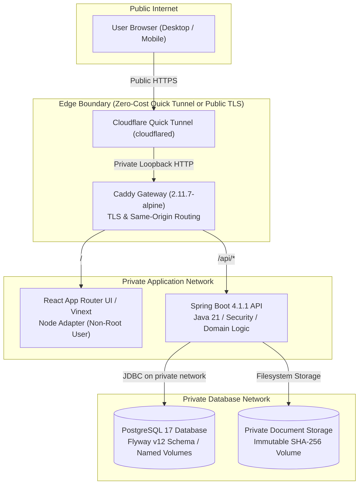
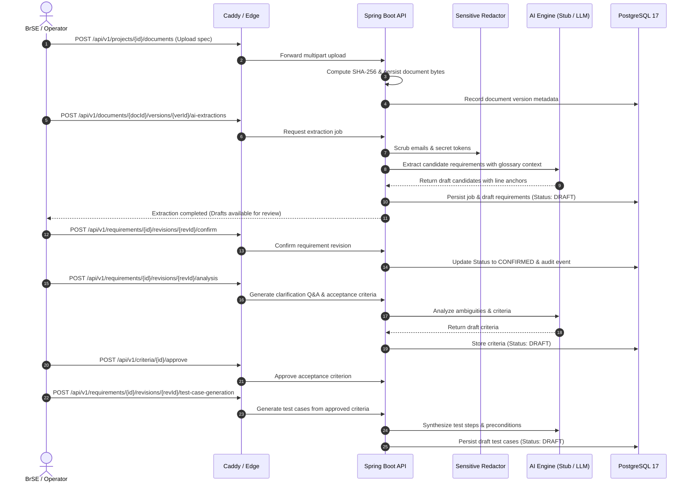

# BridgeFlow Portfolio Case Study

> **AI-Assisted Bilingual Requirements Workspace for Japanese–Vietnamese Delivery Teams**
> *Production-Ready Technical MVP with End-to-End Traceability, Strict Human-in-the-Loop AI Governance, and Zero-Cost On-Demand Demonstration.*

---

## 概要 (Japanese Executive Summary)

BridgeFlow は、日本とベトナム間のオフショア・ハイブリッド開発における「仕様認識の齟齬」「用語の不統一」「変更影響の追跡困難」という長年の課題を解決する要件定義ワークスペースです。
日本語仕様書から構造化された要件候補・受入条件・テストケースを自動抽出・翻訳しつつ、**AIの出力は常に「未承認ドラフト（DRAFT）」として厳格に管理**され、BrSE（ブリッジSE）による確認と承認を経て初めて正式な要件へと昇格します。
システムは Docker Compose によるセキュアな単一オリジン構成（Caddy リバースプロキシ、Spring Boot 4、PostgreSQL 17、Vinext/React）を採用し、通信の暗号化、監査ログ、バックアップ・リストア検証、および完全無料の Cloudflare Quick Tunnel によるオンデマンド・デモ検証を備えています。

---

## 1. Problem Statement & Target Audience

### The Problem in Offshore & Distributed Software Delivery
Cross-border software engineering between Japanese clients and Vietnamese engineering teams frequently encounters severe friction:
1. **Ambiguity & Linguistic Nuance**: Japanese specification documents (要件定義書, 基本設計書) often omit implicit context (e.g., error behaviors, boundary conditions), creating guesswork for overseas developers.
2. **Terminology Inconsistency**: Domain-specific business terms are translated inconsistently across documents, causing implementation defects and costly rework.
3. **Specification Drift & Broken Traceability**: When specifications evolve, downstream artifacts (acceptance criteria, test cases) are rarely synchronized, leading to regressions.
4. **Unchecked AI Hallucination & PII Leaks**: Naive adoption of LLMs exposes internal client data (PII, credentials) and risks introducing unreviewed, hallucinated requirements directly into production backlogs.

### Target Personas
- **Bridge Software Engineers (BrSE)**: Bridges the communication divide; reviews candidate requirements, clarifies ambiguities, manages glossary terms, and confirms changes.
- **Japanese Product Managers & IT Leads**: Provides original Japanese specifications, reviews clarification Q&A, and validates scope alignment.
- **Vietnamese Developers & QA Engineers**: Consumes confirmed bilingual requirements, approved acceptance criteria, and traceable test cases.

---

## 2. Core Value Proposition & Key Capabilities

- **Zero-Trust AI / Strict Human-in-the-Loop**:
  AI is treated as an assistant, never an authority. 100% of generated candidate requirements, clarification questions, acceptance criteria, and test cases originate in `DRAFT` status. Automatic promotion to confirmed status is architecturally prohibited.
- **Project-Scoped Terminology Engine (Glossary)**:
  Maintains explicit Japanese–Vietnamese terminology mappings (e.g., 二要素認証 ↔ Xác thực hai yếu tố) enforced during synthesis and editing.
- **Bidirectional Traceability & Change Impact Analysis**:
  Maintains immutable links from source document byte streams (`SHA-256`) → requirement revisions (`line:N` anchors) → acceptance criteria → test cases. When a requirement changes, a deterministic impact report pinpoints exactly which downstream artifacts require revalidation.
- **Email & Configured-Literal Redaction**:
  A deterministic text scrubber redacts email addresses and explicitly configured confidential literals before AI processing. This is a bounded control, not a claim of general PII or secret detection.
- **Zero Recurring Cost On-Demand Demo**:
  Includes a one-click Cloudflare Quick Tunnel stack enabling instant public HTTPS demonstration (`*.trycloudflare.com`) with zero cloud hosting bills, credit card requirements, or domain ownership costs.

---

## 3. Architecture & Technical Design

### System Overview

### Network Isolation & Hardening
- **Zero Host Ports on Data Services**: Neither Spring Boot, PostgreSQL, nor frontend publish any host ports. Only the Caddy reverse proxy binds loopback (`127.0.0.1:8082:80` for demo).
- **Least Privilege Execution**:
  - `gateway`: Uses a read-only root filesystem, drops all capabilities, and adds back only `NET_BIND_SERVICE` for ports 80/443. The Compose file does not claim a non-root Caddy process.
  - `backend`: Runs as unprivileged `bridgeflow` user (`UID 10001`).
  - `frontend`: Runs as unprivileged `node` user (`UID 1000`).
  - `cloudflared`: Runs as unprivileged user (`65532:65532`).
- **Security Headers**: Gateway enforces `HSTS` (31536000s), `X-Content-Type-Options: nosniff`, `X-Frame-Options: DENY`, and strict referrer policy.
- **Shielded Actuator Probes**: Internal Spring Boot Actuator health and metrics endpoints are completely inaccessible from the public gateway.

---

## 4. End-to-End Requirement Lifecycle & Traceability Flow

---

## 5. Security, Authorization & Privacy Controls

| Layer | Control Implemented | Verification Method |
| :--- | :--- | :--- |
| **Authentication** | Bearer token hashed with SHA-256 before storage; session expiry enforced | Automated integration tests & runtime login drill |
| **Authorization** | Project-scoped RBAC (`ADMIN`, `OPERATOR`, `MEMBER`, `VIEWER`) | Role boundary security tests in Spring Security |
| **Audit Logging** | Append-only audit records for all project, requirement, and document actions | Audit trail assertions in database integration suite |
| **Privacy / Redaction** | Regex-based email scrubbing and configured token redaction (`[REDACTED_EMAIL]`, `[REDACTED]`) | Corpus unit tests in `AiOfflineEvaluationTest` |
| **Credentials Isolation** | Database passwords and provider keys come from ignored runtime environment files; bearer session tokens are stored only as SHA-256 hashes | Tracked secret-pattern scan in CI plus authentication integration tests |
| **Bootstrap Guard** | One-shot initial user creation via `bootstrap-production-user.ps1`; second invocation strictly rejected | Dedicated unit test `ProductionUserBootstrapServiceTest` |

---

## 6. Offline AI Quality & Safety Benchmarks (Milestone 10A)

BridgeFlow implements an automated, deterministic offline evaluation suite for **12 distinct capabilities** against synthetic Japanese–Vietnamese specifications without requiring paid API tokens. Component scores come from production Java classes; pipeline invariants come from named passing service/PostgreSQL tests rather than simulated JavaScript constants.

| Quality & Safety Metric | Release threshold | Evidence source |
| :--- | :---: | :--- |
| **Safety & Redaction Pass Rate** | **100.0%** | Production redactor and service failure test |
| **Human Review Enforcement Rate** | **100.0%** | PostgreSQL/API integration test |
| **Retry & Idempotency Pass Rate** | **100.0%** | PostgreSQL/API integration test |
| **Traceability Completeness** | **100.0%** | PostgreSQL/API integration test |
| **Glossary Adherence Rate** | **100.0%** | Production stub provider |
| **Expected Field Coverage** | **>= 90.0%** | Production stub provider |
| **Invalid / Duplicate Artifact Rate** | **<= 5.0%** | Production stub provider |

- **Evaluated Test Cases**: 16 cases in `eval/corpus/corpus-v1.json`.
- **Provider Spend**: **$0.000000** (using deterministic local stub provider).
- **Report**: `target/ai-evaluation-report.json` records current measured scores and named evidence after the backend suite runs.
- **Cost Boundary**: Any modeled cloud cost is an explicitly illustrative heuristic, not a live quote or real-provider measurement.

---

## 7. Operational Resilience & Disaster Recovery

### Automated Backup & Restore Drill
The operational toolset includes audited PowerShell runbooks:
- `scripts/backup-production.ps1`: Generates a timestamped tar archive containing the PostgreSQL database dump (`pg_dump --clean --if-exists --create`), private document storage volume, and a cryptographically verified manifest (`SHA-256`).
- `scripts/restore-production.ps1`: Restores the complete database and document volumes into an isolated container stack, asserting checksum integrity and login capability before cutover.

### Zero-Cost Demo Tunnel
- `scripts/start-demo-tunnel.ps1`: Deploys the isolated `bridgeflow-demo` stack and connects a temporary Cloudflare Quick Tunnel (`*.trycloudflare.com`).
- `scripts/stop-demo-tunnel.ps1 -RemoveData`: Performs a complete teardown, deleting all temporary containers, networks, volumes, and runtime secrets, leaving the host pristine.

---

## 8. Technical Stack Summary

- **Frontend**: Vinext/Vite with React 19, TypeScript 5.9, Tailwind CSS 4, Radix UI, Lucide Icons, and OpenAPI client generation.
- **Backend**: Spring Boot 4.1.1, Java 21, Spring Security, Spring Data JPA, Apache Tika 3.2 (document parsing), Jackson Databind.
- **Database & Persistence**: PostgreSQL 17, Flyway v12 database migrations.
- **Edge Gateway & Networking**: Caddy 2.11.7-alpine, Cloudflare Tunnel (`cloudflared:2026.9.3`).
- **Testing & Tooling**: JUnit 5, AssertJ, Testcontainers, ESLint 9, TypeScript type checking, Maven 3.10.

---

## 9. Transparent Limitations & Future Roadmap

1. **On-Demand Demo Availability**:
   The `trycloudflare.com` tunnel URL is ephemeral and depends on the local machine and Docker daemon remaining active. It is intended for interactive portfolio demonstrations, not an always-on production SLA.
2. **Provider Scope**:
   Automated regression CI uses the deterministic `stub` provider to ensure reproducibility and zero recurring costs. The implemented external adapter is OpenAI; enabling it requires an approved key and budget in deployment secrets.
3. **Single-Node Architecture**:
   The current technical MVP runs as a hardened single-node Compose deployment. Horizontal autoscaling and Redis distributed queues are deferred until traffic demands justify them.
